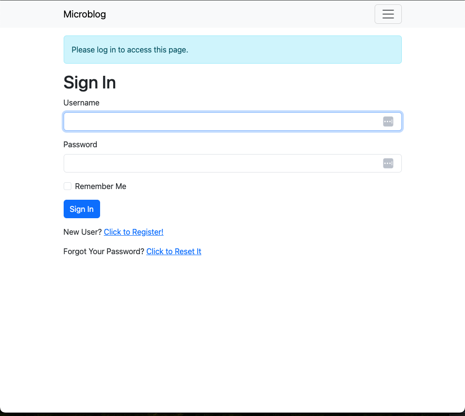
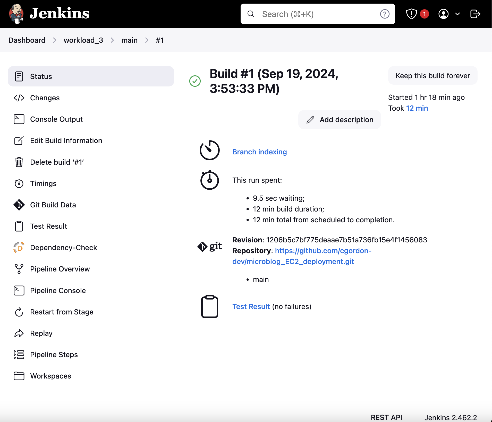
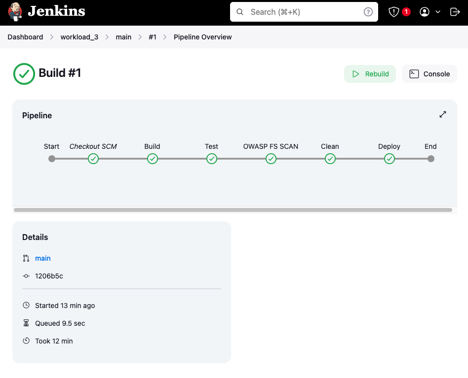
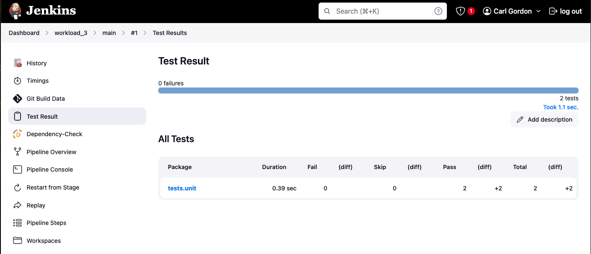
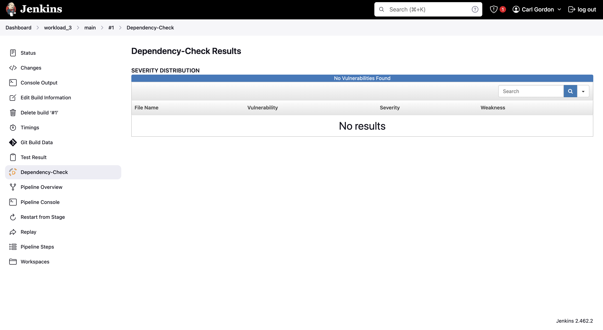
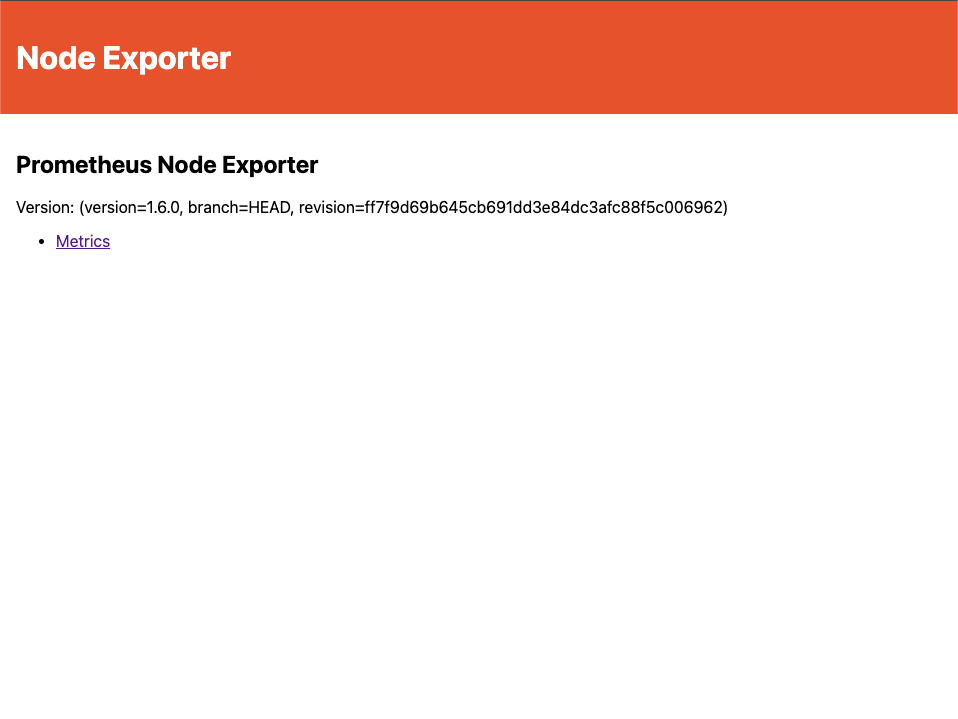
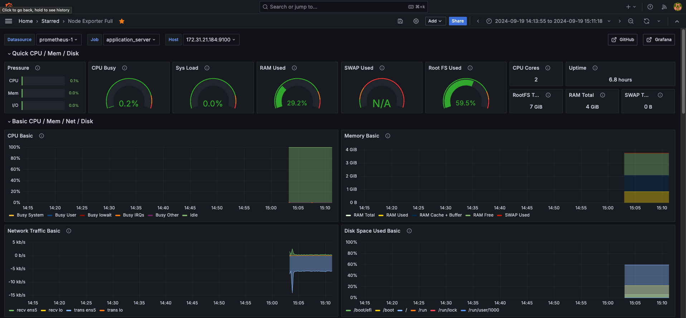
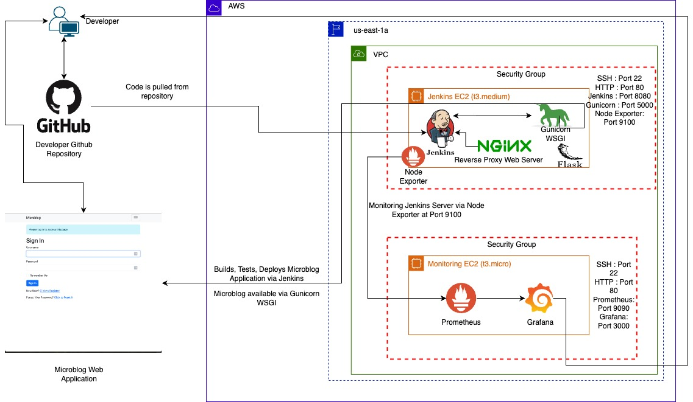

# Microblog Application Deployment - Workload 3

---

## Purpose
The purpose of **Workload 3** is to gain hands-on experience deploying a microblog web application using manually provisioned infrastructure on AWS. This workload moves away from using AWS managed services, such as Elastic Beanstalk, and focuses on setting up an environment using EC2 instances. Additionally, it introduces the use of **Jenkins** for Continuous Integration/Continuous Deployment (CI/CD) and **Prometheus** and **Grafana** for monitoring the application and server resources. 

This project highlights the importance of understanding how to provision and manage infrastructure, implement a CI/CD pipeline, and integrate monitoring for robust application management.

---

## Steps Taken

### 1. Clone the GitHub Repository
The repository containing the microblog application is cloned to the local system.
- Repository Name: **microblog_EC2_deployment**

```bash
$ git clone <https://github.com/cgordon-dev/microblog_EC2_deployment.git>
```

### 2. Create and Configure Jenkins EC2 Instance (t3.medium)
- **Step**: A t3.medium EC2 instance is launched and named `Jenkins`.
- **Security Groups**: Open ports for SSH (22), HTTP (80), Jenkins (8080), Gunicorn (5000), and Node Exporter (9100).
- **Jenkins Installation**:
    - Install Jenkins and enable access via port 8080.
    - Install necessary plugins and set up Jenkins for CI/CD.
  
### 3. Configure Server for Application Deployment
- Install dependencies:
    - **Python 3.9**, **pip**, **nginx**, and other necessary packages.
- Clone the microblog repository onto the Jenkins EC2 instance:
  
```bash
$ git clone <https://github.com/cgordon-dev/microblog_EC2_deployment.git>
$ cd microblog_EC2_deployment
```

- Set up a Python virtual environment and install the required packages:
  
```bash
$ python3.9 -m venv venv
$ source venv/bin/activate
$ pip install -r requirements.txt
$ pip install gunicorn pymysql cryptography
```

- Export the environment variable:
  
```bash
$ export FLASK_APP=microblog.py
```

- Run necessary Flask commands:
  
```bash
$ flask translate compile
$ flask db upgrade
```

### 4. Configure Nginx as a Reverse Proxy
- Edit the Nginx configuration to route traffic to Gunicorn, which serves the Flask application:

```bash
location / {
    proxy_pass http://127.0.0.1:5000;
    proxy_set_header Host $host;
    proxy_set_header X-Forwarded-For $proxy_add_x_forwarded_for;
}
```

- Start Nginx and Gunicorn:

```bash
$ sudo systemctl start nginx
$ gunicorn -w 4 -b 127.0.0.1:5000 microblog:app
```


---

### 5. Set Up Jenkins CI/CD Pipeline
- Create a multi-branch pipeline in Jenkins called `workload_3`.
- Configure the pipeline to pull the latest code from GitHub, build, test, and deploy the microblog application.
- Ensure the Gunicorn process runs in the background to allow Jenkins to complete the deployment.










--- 

### 6. Set Up Monitoring EC2 Instance (t3.micro)
- **Step**: Launch another t3.micro EC2 instance named `Monitoring` for running Prometheus and Grafana.
- **Security Groups**: Open ports for SSH (22), HTTP (80), Prometheus (9090), and Grafana (3000).
- **Prometheus Installation**:
    - Install Prometheus and configure it to scrape metrics from the Node Exporter on the Jenkins EC2 instance.
    - Prometheus listens on port 9090.
- **Grafana Installation**:
    - Install Grafana to visualize Prometheus metrics.
    - Grafana runs on port 3000.

### 7. Node Exporter Installation on Jenkins EC2
- Install **Node Exporter** to expose system metrics (CPU, memory, disk, etc.) on the Jenkins server.
- Metrics are exposed on **port 9100** for Prometheus to scrape.

### 8. Monitoring Setup
- Configure Prometheus on the Monitoring EC2 to scrape metrics from Node Exporter running on Jenkins EC2.
- Set up Grafana dashboards to visualize real-time server and application performance.



---

## System Design Diagram
The architecture is composed of two EC2 instances:
- **Jenkins EC2 (t3.medium)**: Deploys the microblog application and runs Node Exporter for monitoring.
- **Monitoring EC2 (t3.micro)**: Hosts Prometheus and Grafana for collecting and visualizing server metrics.



### Components and Structure:

#### **Developer & GitHub Repository**:
- **Developer**: Pushes the application code to a GitHub repository.
- **GitHub Repository**: Acts as the source control where the code for the microblog application is stored. Jenkins pulls the latest code from here to build and deploy the application.

#### **AWS Infrastructure**:
- **Region**: AWS `us-east-1a` region is used for deploying resources.
- **Virtual Private Cloud (VPC)**: A private network within AWS where the EC2 instances are hosted.

#### **Jenkins EC2 (t3.medium)**:
This instance is responsible for the deployment and server setup.
- **Jenkins**: Manages the CI/CD pipeline. It pulls the code from the GitHub repository, builds, tests, and deploys the application.
  - Jenkins listens on **Port 8080** for web interface access.
- **Nginx**: Acts as a reverse proxy server that forwards web requests to the application running on Gunicorn and Flask.
  - Nginx listens on **Port 80** for HTTP traffic.
- **Gunicorn WSGI**: Serves the Python Flask web application.
  - Gunicorn serves the app on **Port 5000**.
- **Flask Microblog Application**: The actual application deployed via Jenkins and served using Gunicorn. It provides a web interface (login page shown).
- **Node Exporter**: A monitoring agent running on this EC2 instance to collect server resource metrics like CPU, memory, and disk usage. 
  - It exposes the metrics on **Port 9100** for Prometheus to scrape.
- **Security Group**: The EC2 instance’s security group allows SSH traffic (**Port 22**), HTTP (**Port 80**), Jenkins access (**Port 8080**), Gunicorn (**Port 5000**), and monitoring through Node Exporter (**Port 9100**).

#### **Monitoring EC2 (t3.micro)**:
This instance is dedicated to monitoring the Jenkins server and application.
- **Prometheus**: A monitoring tool that scrapes and stores metrics from the Jenkins EC2 (via Node Exporter). Prometheus listens on **Port 9090** for metric querying.
- **Grafana**: A visualization tool connected to Prometheus. It provides dashboards to visualize server and application metrics. Grafana runs on **Port 3000** for web access.
- **Security Group**: The security group allows SSH (**Port 22**), HTTP (**Port 80**), Prometheus access (**Port 9090**), and Grafana (**Port 3000**).

#### **Flow and Interaction**:
1. The **developer** pushes code to **GitHub**, where it is version controlled.
2. Jenkins pulls this code from the repository, builds, tests, and deploys the microblog application on the **Jenkins EC2** instance.
3. The application is served via **Gunicorn** and accessible through **Nginx**.
4. **Node Exporter** on the Jenkins EC2 sends server metrics to **Prometheus**, which is installed on the **Monitoring EC2** instance.
5. **Grafana** retrieves metrics from Prometheus and displays them via customizable dashboards for real-time monitoring of the application and server performance.

---

### Issues and Troubleshooting

#### Running Tests

I reached the point in the workload where doing pytest commands to test some features within the application was not working. I encountered a **ModuleNotFoundError** for 'microblog', occurring because Python couldn't locate the workload's modules. The solution was to set the `PYTHONPATH` environment variable by running the command:

```bash
export PYTHONPATH=$(pwd)
```

This command enables Python to include the current working directory in its module search path, ensuring it can correctly locate and import the workload's modules when running scripts or tests.

#### Upgrading Instance Size to support OWASP Dependency-Check Scan

I experienced frequent crashes during the **OWASP Dependency-Check** stage on my EC2 instance. After several attempts, which included deleting and rebuilding the multibranch pipeline, I received guidance to switch to a **t3.medium** EC2 instance, which helped stabilize the instance, though issues persisted with the OWASP stage. I observed warnings such as:

- `[INFO] Checking for updates`
- `[WARN] An NVD API Key was not provided...`
- `[INFO] NVD API has 262,868 records in this update`
- `[WARN] Retrying request...`

These warnings indicated that the **NVD API** was rate-limiting requests due to the lack of an API key, causing slow or failed updates. With over 260,000 records in the National Vulnerability Database (NVD), the system repeatedly retried requests, leading to delays.

I resolved this by registering for a free **NVD API key** and adding it to the pipeline script. This significantly reduced the amount of time spent doing a depandancy check and the pipeline build was completed!

#### Deploying the Application

I had some issue in the deploy stage of the Jenkins pipeline when starting up the application the application using the following command to the pipeline script:

```bash
gunicorn -b :5000 -w 4 microblog:app
```

Externally, I confirmed that the microblog application started successfully, but the Jenkins pipeline would not complete, and stopping the pipeline also terminated the application. 

I saw that because **Gunicorn** runs in within the pipeline, preventing it from moving on to the next steps. When the pipeline stops, so does Gunicorn. I initially added the ```--daemon ``` flag to the gunicorn command, but issues still persisted.

The solution to this was to configure Gunicorn as a **systemd service**. This approach allows Gunicorn to run independently of the Jenkins pipeline, ensuring it remains active across reboots or pipeline restarts. This makes the deployment process more reliable and production-ready.


---

## Optimizations

### Infrastructure Flexibility
- **Self-Provisioned Infrastructure**: Compared to AWS-managed services like Elastic Beanstalk, provisioning your own resources allows more control over the environment, configurations, and application behavior.
  
### System Improvements:
1. **Performance Scaling**: As traffic increases, horizontal scaling (adding more instances) of the Jenkins server and load balancing can optimize resource usage and improve performance.
2. **Security**: Applying more granular security group rules and enabling HTTPS for traffic can enhance security.
3. **Automation**: Use infrastructure-as-code tools like Terraform to automate the setup of EC2 instances, reducing the manual workload and minimizing the risk of human error.

---

## Conclusion

This workload provided a comprehensive experience in deploying a web application manually on AWS, setting up a CI/CD pipeline with Jenkins, and implementing real-time monitoring using Prometheus and Grafana. While this method offers greater control over the deployment and monitoring process, it requires careful management of resources and infrastructure to ensure reliability and performance.

By learning to manage each component individually, this workload highlights the complexities involved in cloud-based infrastructure and monitoring, helping to build a deeper understanding of cloud architecture and DevOps practices.


